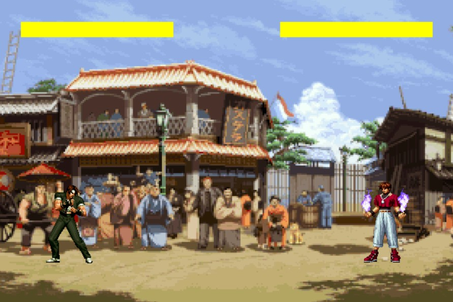

# King of Fighters

This repo is a simple implementation of the game "The King of Fighters (KOF)" using Python.



## Environment

1. Clone this repo via:

  ```bash
  git clone https://github.com/jxyang710/King-of-Fighters.git
  ```

2. Install the necessary packages via:

	```bash
	pip install pygame
	```

## Execution

Run the game via:

```bash
cd King-of-Fighters
python game.py
```

## TODO List

- [ ] more actions and combos to be implemented.
- [ ] more roles and backgrounds to be added.

## Acknowledgement

All images used in this project were obtained from [here](https://www.aigei.com/).